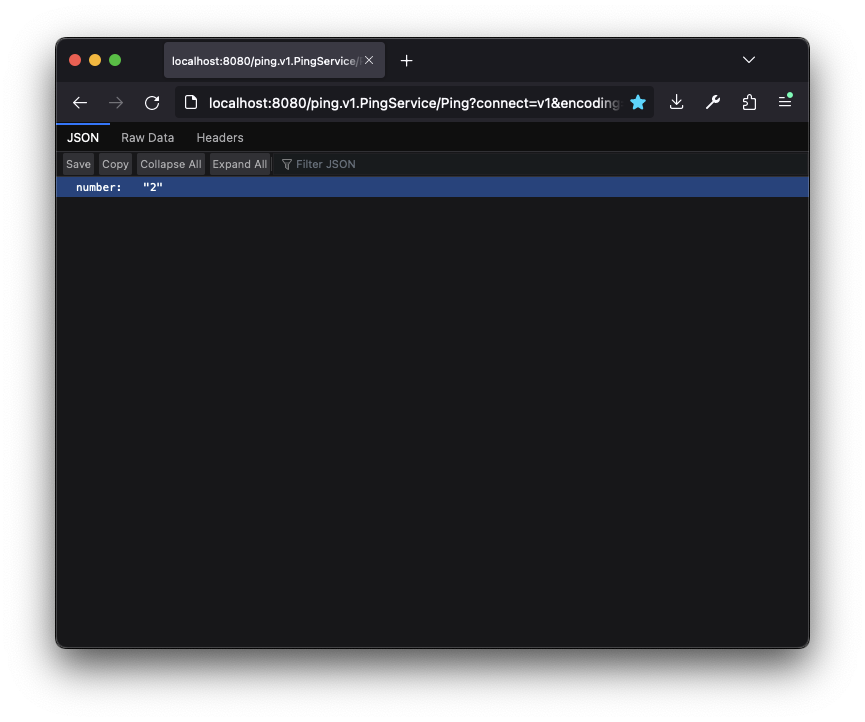

# Connect-gRPC Envoy Bridge Demo
This repository contains a small demo of how to use the Connect-gRPC Envoy bridge.

## Try it out!
To run locally, clone this repository:
```sh
git clone https://github.com/bufbuild/connect-envoy-demo
cd connect-envoy-demo
```

Then run `docker-compose up` to run everything:
```sh
docker-compose up
```

After a minute or two, there should be a server listening on port 8080.

It's possible to [browse to it directly](http://localhost:8080/ping.v1.PingService/Ping?connect=v1&encoding=json&message={%22number%22:2}), taking advantage of Connect's HTTP `GET` support:


> **Note**:
> The Connect-gRPC filter *requires* the Connect protocol version to be set in the request to have any effect. For GET requests, this means including `connect=v1` as a query parameter in the URL. For POST requests, this means including `Connect-Protocol-Version: 1` in the HTTP request headers. **Official Connect clients will do this automatically.**

It's also possible to interact using `buf curl`. Since our Envoy configuration has both the Envoy gRPC Web filter and the Connect-gRPC bridge filter setup, we can use any of the available protocols:

```sh
$ buf curl http://localhost:8080/ping.v1.PingService/Ping --http2-prior-knowledge --schema . -d '{"number":2}' --protocol grpc
{"number":"2"}
$ buf curl http://localhost:8080/ping.v1.PingService/Ping --http2-prior-knowledge --schema . -d '{"number":2}' --protocol grpcweb
{"number":"2"}
$ buf curl http://localhost:8080/ping.v1.PingService/Ping --http2-prior-knowledge --schema . -d '{"number":2}' --protocol connect
{"number":"2"}
```

## How it works

The gRPC server included in this repository is a typical gRPC-Go server with one simple addition&mdash;it includes [a JSON codec](./internal/codec/json/codec.go). This makes it a lot simpler to interact with directly without the use of a Connect or gRPC client, though this is by no means required.

Then we have our [Envoy configuration](./envoy.yaml). The most important snippet is this part:

```yaml
http_filters:
- name: envoy.filters.http.connect_grpc_bridge
  typed_config:
    "@type": type.googleapis.com/envoy.extensions.filters.http.connect_grpc_bridge.v3.FilterConfig
- name: envoy.filters.http.grpc_web
  typed_config:
    "@type": type.googleapis.com/envoy.extensions.filters.http.grpc_web.v3.GrpcWeb
```

These two filters will convert from the Connect and gRPC-Web protocols down to native gRPC for the upstream server.

Finally, to show all of this off in a contained environment, a [Docker Compose manifest](./docker-compose.yaml) is included. It is trivial, containing only the Envoy container and the upstream vanilla gRPC server.

## Try it with your server!
If you already use Envoy, please update to Envoy v1.26 and give the new Connect-gRPC bridge filter a try. Let us know how it works, and if you find any issues!
